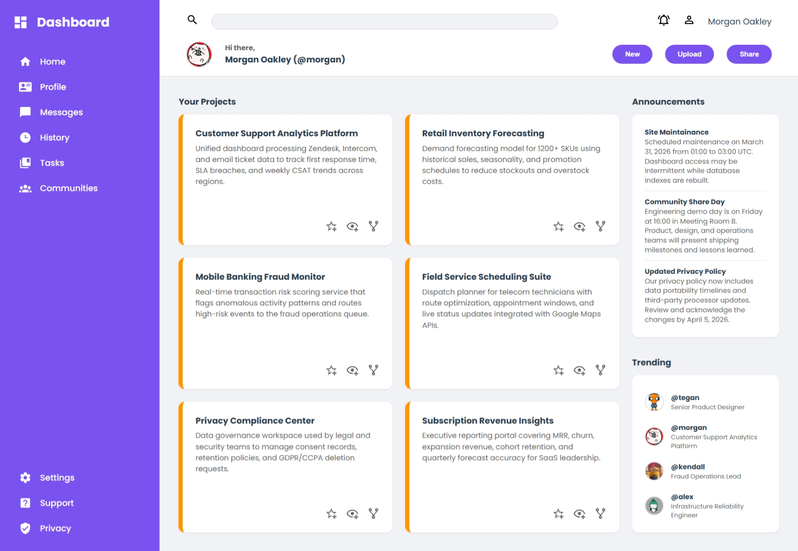

# Admin Dashboard

A modern, professional admin dashboard built with HTML, CSS, and vanilla JavaScript. Features a clean design with real-world data, consistent color scheme, and interactive UI elements.



## 🎨 Features

- **Responsive Grid Layout** - Flexible 2-column layout with sidebar navigation
- **Project Management** - Track and manage multiple projects with detailed descriptions
- **Announcements Section** - Display important company-wide updates
- **Trending Users** - Showcase trending team members with roles
- **Professional Color Scheme** - Cohesive purple, orange, and gray palette
- **Interactive Elements** - Hover effects on cards, buttons, and icons
- **Clean Typography** - Uses Google Fonts (Poppins) for modern appearance

## 🏗️ Project Structure

```
admin-dashboard/
├── index.html          # Main HTML structure
├── style.css           # Styling and layout
├── images/             # SVG icons and profile pictures
│   ├── magnify.svg
│   ├── bell-ring-outline.svg
│   ├── account-outline.svg
│   ├── star-plus-outline.svg
│   ├── eye-plus-outline.svg
│   ├── source-fork.svg
│   ├── profile-pfp.png
│   ├── profile-pfp1.png
│   ├── profile-pfp2.png
│   └── profile-pfp3.png
└── README.md           # This file
```

## 🎯 Sections Overview

### Sidebar Navigation
- Dashboard branding with logo
- Main navigation menu (Home, Profile, Messages, History, Tasks, Communities)
- Settings menu (Settings, Support, Privacy)
- Smooth hover transitions

### Header
- Search bar with icon
- Notification and account icons
- User greeting section
- Action buttons (New, Upload, Share)

### Main Content Area

#### Your Projects (Left Column)
- 6 project cards with:
  - Project title
  - Real-world descriptions
  - Interactive icons (star, eye, fork)
  - Orange left border accent
  - Hover shadow effects

#### Announcements & Trending (Right Column)
- **Announcements**: 3 company updates with dates and details
- **Trending**: 4 trending team members with roles and profile images

## 🎨 Color Palette

| Color | Hex | Usage |
|-------|-----|-------|
| Primary Purple | `#7952EF` | Sidebar, buttons |
| Accent Orange | `#FF9500` | Card left border |
| Dark Text | `#2D3E50` | Headings, titles |
| Gray Text | `#666666` | Descriptions |
| Light Background | `#F0F2F5` | Main content area |
| White | `#FFFFFF` | Cards, header |
| Border Gray | `#E0E0E0` | Dividers |

## 💻 Technologies Used

- **HTML5** - Semantic structure with SVG icons
- **CSS3** - Grid layout, flexbox, transitions, hover effects
- **Google Fonts** - Poppins font family
- **SVG Icons** - Material Design icons from Material Community Icons

## 🚀 Getting Started

1. Clone or download the project
2. Open `index.html` in a modern web browser
3. No build process or dependencies required

## 📱 Browser Compatibility

- Chrome/Edge 90+
- Firefox 88+
- Safari 14+
- Modern mobile browsers

## 🎬 Interactive Elements

- **Sidebar items** - Hover effects with subtle background change
- **Project cards** - Enhanced shadow on hover
- **Card icons** - Scale up and opacity change on hover
- **Buttons** - Color change, lift effect, shadow on hover
- **Trending cards** - Slide effect on hover

## 📝 Real-World Data

Project cards include realistic descriptions:
- Customer Support Analytics Platform
- Retail Inventory Forecasting
- Mobile Banking Fraud Monitor
- Field Service Scheduling Suite
- Privacy Compliance Center
- Subscription Revenue Insights

Announcements include practical business updates with dates and context.

## 🔧 Customization

### Colors
Edit color values in `style.css`:
- Primary color: Search for `#7952EF`
- Accent color: Search for `#FF9500`
- Text colors: Search for `#2D3E50` or `#666666`

### Content
Edit text in `index.html`:
- Project titles and descriptions in `.main-card` divs
- Announcements in `.ann-card`
- Team members in `.trending-section`

### Layout
Grid columns and spacing can be adjusted via `.projects-panel` and main layout classes in `style.css`.

## 📄 License

Open source - feel free to modify and use for your projects.

## 👤 Author

Built as part of The Odin Project admin dashboard exercise.

---

**Last Updated:** March 28, 2026
